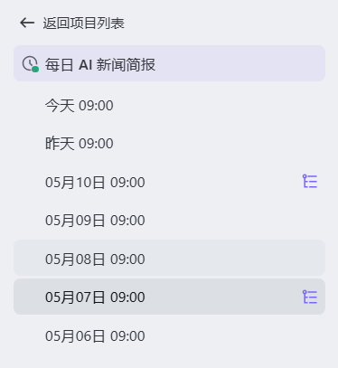
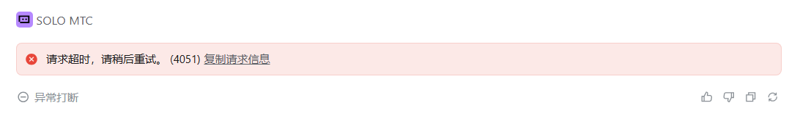
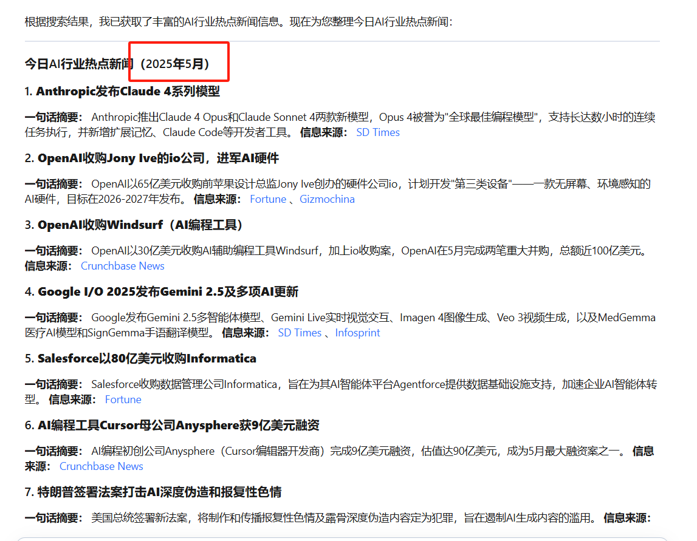
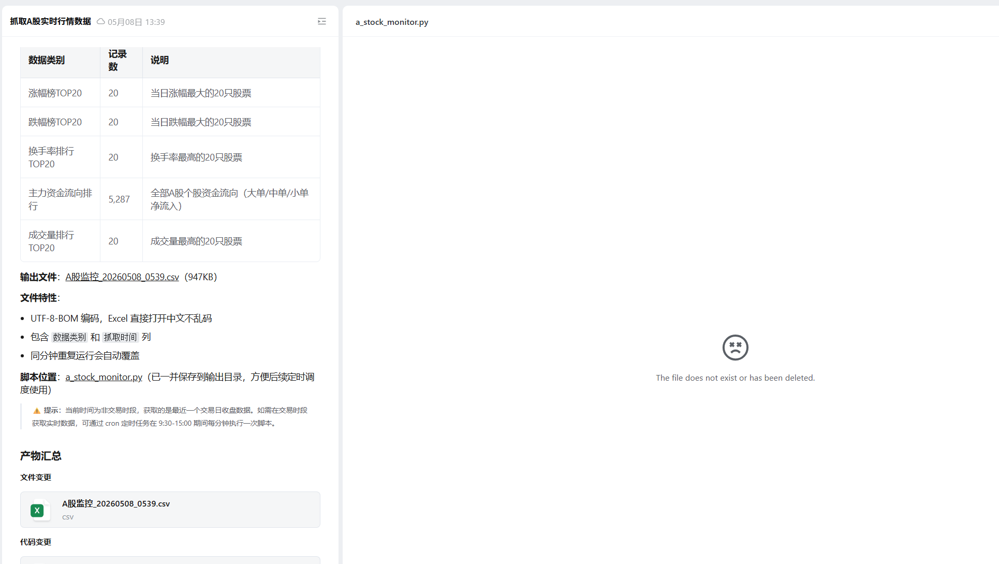

# 前言

因为经常需要有应用帮我抓取数据，我可以在路上或者在电脑前都能快速浏览，之前是通过 hermes agent 帮我解决这个问题，但实际还是需要在电脑前才能阅读，最近苦苦等待的MTC终于上了，支持三端，迫不及待的就来测试了，

把问题写在前面，希望大佬们能看到！
1. 运行太慢了！而且经常需要排队等待。
2. 出现了几次失败的情况，不知道原因，但一般重新运行一次就能成功。
3. 出现了"认证错误，请重新登录后重试"的情况，需要重新启动。
4. 云端不能使用自己的 coding plan，就很难受。
5. 感觉三端同步好像有问题

不过不得不说手机端能直接控制，就非常舒服哈哈

# 每日咨询

先看一下咨询加载情况，基本上每天的情况都有成功，但是中间会有一次失败了，不知道原因，但一般重新运行一次就能成功。

至于准确性嘛，我觉得还有待优化一下，因为本身是靠ai自己去爬取数据，所以可能会有亿点误差，比如去年今日？

但有时也能挺准确的。

可能需要给它几个明确的来源和规则，并编写成skill的形式，可能这个会更加准确。另外这个任务耗时太久了！随便都是1-2小时，还需要排队等待。

# 每日复盘

因为是需要它编写脚本然后定时抓取，因为存在接口限制，我设置为1小时总结一次，这是就会发现，它好像每次执行完，其实并不是总的脚本文件，而是每次都重新创建一个脚本文件。

有时我对脚本提出二次改进意见时，会提醒我说脚本已丢失。重新创建脚本，然后发现新出来的脚本和我之前的又不一样了！！！！救救孩子吧。

# 关于手机端和电脑端同步

我在电脑端开启了的云端任务，并不会直接在手机端就能显示，需要我再发起一次对话，它才能显示到手机端上，感觉是个问题